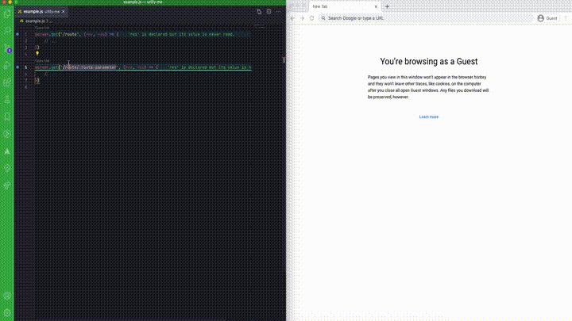

# urlify-me README

Generate links from express route definitions
## Features

- Generate links from express route definitions 
- Supports variable routes (e.g. `server.get('/:variable')` will let you specify what to use each time you click the codelens)
- Supports optional routes (e.g. `server.get('/route(/optional)?')`)

## Extension Settings

This extension contributes the following settings:

* `urlify-me.enableCodeLens`: enable/disable codelens
* `urlify-me.baseUrls`: string array of available base urls, e.g. ["http://www.example.com", "https://dev.example.com"]

## Release Notes

### 0.0.1

Initial release of urlify-me.
### 0.0.2

Only trigger codelens for js files
Add 
